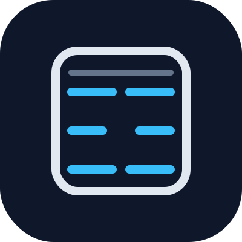

<p align="center">
  
</p>

# Super Tanks v3.2

[](https://github.com/kndw-as/super-tanks/actions/workflows/tests.yml)
[](LICENSE)
[](#owasp-top-10-for-agentic-applications-asi-2026)
[](#)

**The governance layer that makes AI autonomy possible.**

Not a detection tool that reacts after something goes wrong. 10 simultaneous security layers that prevent it from happening in the first place.

<p align="center">
  
</p>
<p align="center"><sub>GO-Gate in action — reproduce it yourself: <code>python3 scripts/demo_go_gate.py</code></sub></p>

```bash
git clone https://github.com/kndw-as/super-tanks.git
cd super-tanks
less install.sh        # review the script before running it
./install.sh
```

## What is Super Tanks?

Super Tanks is a compliance-by-design security and governance architecture for autonomous AI agents. It controls what AI agents can and cannot do at the architectural level — every action is mediated through 10 enforcement layers before it reaches a tool, a model, or the outside world.

- **10 security layers** running simultaneously
- **5-level user access** — explicit access control per principal
- **Works offline** — local AI via Ollama, no cloud required
- **Auditable** — every decision logged, every soul SHA256-sealed
- **Open source** — Apache 2.0

## The 10 Security Layers

| # | Layer | What it does |
|---|-------|-------------|
| 1 | **ZEF Firewall** | Secondary LLM filter against obfuscated prompt injection |
| 2 | **Soul Files** | SHA256-sealed agent identity — tamper-evident |
| 3 | **DIQ Layer** | Declarative interface contracts — frozen tool surfaces |
| 4 | **Allowlists** | Per-agent access control — explicit allow, default deny |
| 5 | **GO-Gate** | Human-in-the-loop approval for risky actions |
| 6 | **Sandbox** | Docker isolation for untrusted execution |
| 7 | **Circuit Breaker** | Per-agent rate-limit on tool invocations |
| 8 | **Tool Zone Isolation** | 49 tools partitioned into 7 zones |
| 9 | **MCP Security Manager** | Trust-level enforcement for MCP servers |
| 10 | **allowed_agents** | Skill-level isolation per agent (added 2026-05-25) |

## OWASP Top 10 for Agentic Applications (ASI 2026)

Super Tanks is built against the [OWASP Top 10 for Agentic Applications 2026](https://genai.owasp.org/resource/owasp-top-10-for-agentic-applications-for-2026/) — the first globally peer-reviewed security framework for autonomous AI systems. The architecture predates the standard but maps cleanly to every category.

| ASI | Threat | Super Tanks layers that address it |
|---|---|---|
| **ASI01** | Agent Goal Hijack — attacker manipulates objectives, instructions, or decision path | ZEF Firewall (1), Soul Files (2), Allowlists (4), GO-Gate (5) |
| **ASI02** | Tool Misuse & Exploitation — unsafe or attacker-induced tool use | DIQ Layer (3), Allowlists (4), Tool Zone Isolation (8), Circuit Breaker (7), GO-Gate (5), allowed_agents (10) |
| **ASI03** | Agent Identity & Privilege Abuse — identity gaps, privilege escalation | Soul Files (2), Allowlists (4), allowed_agents (10), 5-level user access |
| **ASI04** | Agentic Supply Chain Vulnerabilities — poisoned MCP/A2A registries, tampered tool descriptions | MCP Security Manager (9), DIQ Layer (3), Sandbox (6), Tool Zone Isolation (8) |
| **ASI05** | Unexpected Code Execution (RCE) — natural-language paths trigger arbitrary execution | Sandbox (6), GO-Gate (5), ZEF Firewall (1), DIQ Layer (3), Tool Zone Isolation (8) |
| **ASI06** | Memory & Context Poisoning — long-lasting behavior changes via poisoned memory | Soul Files (2), RBAC + tripwires in memory module, DIQ Layer (3) |
| **ASI07** | Insecure Inter-Agent Communication — spoofed messages misdirect agent clusters | A2A whitelist + escalation rules, Allowlists (4), Soul Files (2) |
| **ASI08** | Cascading Failures — multi-step failures spread across workflows | Circuit Breaker (7), GO-Gate (5), LOCKDOWN mode, full audit log |
| **ASI09** | Human-Agent Trust Exploitation — attackers exploit human-agent trust | GO-Gate (5) with Telegram approvals, audit log, content filter |
| **ASI10** | Rogue Agents — agents act beyond intended scope | Soul Files (2), Allowlists (4), allowed_agents (10), Zeph proactive monitoring, Dual Mode |

## MITRE ATLAS mapping

Beyond OWASP, Super Tanks maps to the [MITRE ATLAS](https://atlas.mitre.org/) adversary-technique matrix — the framework most enterprise security teams already use for AI threat modelling and red-teaming. The agent-relevant techniques and the layers that address them:

| ATLAS technique | Threat | Super Tanks layers |
|---|---|---|
| **AML.T0051** — LLM Prompt Injection (Direct & Indirect) | Crafted input subverts the model's instructions; indirect payloads ride in via retrieved/tool content | ZEF Firewall (1); tool-output re-scan + `untrusted_content` provenance tagging (`gateway._scan_response_for_injection`); DIQ (3); GO-Gate (5) |
| **AML.T0054** — LLM Jailbreak | Prompt forces the model past its guardrails | ZEF Firewall (1), Soul Files (2), LOCKDOWN / Night mode, Trust score |
| **AML.T0057** — LLM Data Leakage | Crafted queries pull out secrets or training data | Allowlists (4), Tool Zone Isolation (8), `secret_probe` filters, audit sanitiser |
| **AML.T0053** — LLM Plugin Compromise | A poisoned tool/plugin is induced into unsafe action | MCP Security Manager (9), DIQ frozen contracts (3), Tool Zone Isolation (8) |
| **AML.T0010** — ML Supply Chain Compromise | Poisoned model, registry, or dependency | MCP Security Manager (9), DIQ frozen contracts (3), Sandbox (6) |
| **AML.T0024 / T0025** — Exfiltration via inference API / cyber means | Data smuggled out through the agent's own channels | `data_exfil` egress filters, Allowlists (4), append-only audit log |
| **AML.T0012** — Valid Accounts | Stolen or forged agent identity used to act | HMAC identity tokens (`core/security/agent_identity.py`), Allowlists (4), Trust score |

*ATLAS is a living framework; technique IDs are given per the current matrix at [atlas.mitre.org](https://atlas.mitre.org/) and should be verified there before formal audit use.*

### Measured baseline

The ZEF prompt-injection filter is measured against an adversarial corpus on every CI run (`scripts/zef_baseline.py`, `tests/security/redteam/`). Current regex-layer baseline: **100% block rate (57/57 attacks), 0% false positives (0/28 clean cases, including Norwegian near-misses), 100% warn surfacing (3/3).** The corpus is high-signal rather than exhaustive — see [`docs/RISK_REGISTER.md`](docs/RISK_REGISTER.md) (R-22) for the planned fuzzing harness.

### Designed to prevent — real-world incidents from 2026

| Incident | Date | Class | Super Tanks defense |
|---|---|---|---|
| Anthropic MCP SDK STDIO command execution | Apr 2026 | ASI05 / ASI04 | Sandbox + DIQ (no STDIO without frozen contract) |
| ContextCrush (Noma Security disclosure) | 5 Mar 2026 | ASI06 | Soul Files + memory tripwires |
| Mercor / LiteLLM credential breach | 2 Apr 2026 | ASI03 / ASI04 | Allowlists + MCP Security Manager |
| ~200,000 unauthenticated MCP instances exposed | 2026 | ASI04 | MCP Security Manager (trust levels) |
| Nine of eleven MCP registries poisoned (OX research) | Apr 2026 | ASI04 | DIQ frozen contracts + zone isolation |
| Invariant Labs MCP Tool Poisoning (TPA / FSP) | Mar 2025 | ASI02 / ASI04 | DIQ Layer + Tool Zone Isolation |

### Compliance posture for the EU AI Act

The EU AI Act's obligations phase in over several years rather than on a single date. Following the **Digital Omnibus** political agreement (7 May 2026), most stand-alone high-risk obligations — **Art. 12 (logging)**, **Art. 14 (human oversight)**, **Art. 15 (robustness & cybersecurity)** and **Art. 27 (FRIA)** — are deferred to **~2 December 2027**. **Art. 13 (transparency)** and certain other duties still apply from **2 August 2026**, and Annex I product-embedded high-risk systems follow on **2 August 2028**.

> The Digital Omnibus is a provisional political agreement, not yet final law — these dates may move. This section is not legal advice; verify the current timeline before relying on it.

The obligations are coming, and preparing for them takes time. Super Tanks aims to give you the architectural controls early, so readiness becomes a matter of configuration rather than a scramble:

- Logging and traceability (Art. 12) — every decision recorded, every soul SHA256-sealed
- Human oversight (Art. 14) — GO-Gate is human-in-the-loop by design
- Robustness and cybersecurity (Art. 15) — multiple simultaneous enforcement layers
- Transparency (Art. 13) — auditable decisions and a published [system card](SYSTEM_CARD.md)

This is compliance-by-design, not compliance-by-audit: the controls exist before the deployment, not after.

## Further mappings

Beyond OWASP, MITRE ATLAS, and the EU AI Act above, Super Tanks publishes two more standards mappings:

- **[Agent Control Specification (ACS)](docs/ACS_MAPPING.md)** — how the 10 layers cover the ACS five runtime checkpoints (input, LLM, state, tool execution, output).
- **[NIST AI governance](docs/COMPLIANCE_NIST.md)** — AI RMF (GOVERN/MAP/MEASURE/MANAGE), AI 600-1 GenAI Profile, and the emerging IR 8596 Cyber AI Profile / COSAiS agentic overlays.

## Install

Super Tanks is a server-side framework (Docker + Python + Ollama). It installs on
a machine you control — a Linux server or desktop is the primary target.

### Linux (primary)
```bash
git clone https://github.com/kndw-as/super-tanks.git
cd super-tanks
less install.sh        # review the script before running it
./install.sh
```

### macOS
Same steps as Linux. Requires Docker Desktop.

### Windows
Use WSL2 (or Git Bash) and follow the Linux steps above. Platform helpers live in
[`installer/`](installer/).

### Access from your phone (iOS / Android)
Super Tanks does not run *on* a phone — but it doesn't need to. The dashboard and
setup wizard are a web UI: once the stack is running, open `http://<host>:8765`
from any browser (iPhone, iPad, Android), or reach it securely over Tailscale.
**GO-Gate** approval prompts also arrive via **Telegram**, so you can approve or
deny agent actions from your phone.

### What happens
1. Docker is installed (if needed)
2. Ollama is installed (local AI engine)
3. Super Tanks containers start
4. Setup wizard opens at `http://localhost:8765/setup`
5. Answer a few questions — your agent stack is ready

## User Access Levels

| Level | Name | Access |
|-------|------|--------|
| 5 | Full | Everything — system admin |
| 4 | Near-full | Like 5, but can't delete system or last admin |
| 3 | Configured | Chat + configured tool zones + status panels |
| 2 | Standard | Chat + permitted tools within their zone |
| 1 | Limited | One agent only, content filter + curfew apply |

Per-user settings (independent of level): curfew, emergency override, content filter, permitted tools, alert preferences.

## Dual Mode

**LOCKDOWN** — All write/exec operations require human approval.
**AUTONOMOUS** — Agents act independently. Timed (auto-returns to lockdown). Night mode reduces autonomy after 21:00.

## Philosophy

Super Tanks has no opinion about who uses your system. Not how many principals. Not their roles. Not their relationships. You assign access levels. You set filters. You decide who can do what. Super Tanks enforces whatever you decide — nothing more, nothing less.

## Tech Stack

- **Python 3.12** — core framework
- **SQLite** (WAL mode) — all databases
- **Ollama** — local LLM inference (llama3.2:3b, nomic-embed-text)
- **Docker** — containerized deployment
- **Telegram Bot API** — notifications and approvals

## Project Structure

```
super-tanks/
├── core/
│   ├── security/     ZEF, trust, budget, mode, allowlists, users
│   ├── diq/          Frozen contracts + tool registry
│   ├── memory/       RBAC, audit, tripwires, hierarchical store
│   ├── a2a/          Agent escalation rules
│   ├── zeph/         Proactive monitoring
│   ├── gateway.py    Tool dispatch
│   ├── ask_admin.py  GO-Gate approval system
│   └── db/           SQLite connection helper
├── scripts/          Verification + review scripts
├── installer/        Windows/macOS install helpers
├── dashboard-static/ Setup wizard
├── config/           Templates (no real data)
├── Dockerfile
├── docker-compose.yml
└── install.sh
```

## License

Apache 2.0 — see [LICENSE](LICENSE).

## Author

William Louis Park — [KNDW Shelter Solutions AS](https://kndw.no)

Built with Claude (Anthropic), Gemini (Google), and Kimi (Moonshot).
